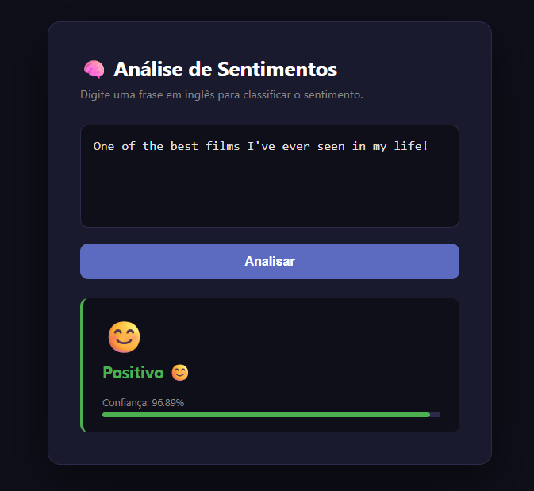

# 🧠 Sentiment Analysis — Deep Learning

A deep learning application for sentiment analysis of movie reviews, classifying text as **Positive** or **Negative** with a confidence score.

---

## 📌 Overview

This project uses a neural network trained on movie reviews to predict the emotional tone of a given sentence. It includes a REST API backend and an interactive web interface.

---

## ✨ Features

- Binary sentiment classification (Positive / Negative)
- Confidence score with visual progress bar
- Responsive dark-themed web UI
- REST API endpoint for predictions
- Handles edge cases: irony, mixed sentiment, double negation

---

## 🖥️ Demo



> Type a movie review in English and get instant sentiment feedback with a confidence score.

---

## 🗂️ Project Structure

```
sentiment-analysis/
├── model/
│   ├── train.py          # Training script
│   ├── predict.py        # Inference logic
│   └── model.pth         # Saved model weights
|
├── app.py                # Flask/FastAPI server
│      
├── remplates/
│   └── index.html        # Web interface
├── requirements.txt
└── README.md
```

---

## 🚀 Getting Started

### Prerequisites

- Python 3.10+
- pip

### Installation

```bash
# Clone the repository
git clone https://github.com/valdirsillva/sentiment-analysis
cd sentiment-analysis

# Create and activate a virtual environment
python3 -m venv venv
source venv/bin/activate  # Windows: venv\Scripts\activate

# Install dependencies
pip install -r requirements.txt
```

### Running the Application

```bash
uvicorn app:app --reload --host 0.0.0.0 --port 800
```

Then open your browser at `http://localhost:5000`.

---

## 🔌 API

### `POST /predict`

Classifies the sentiment of a given text.

**Request body:**
```json
{
  "text": "This movie was absolutely amazing!"
}
```

**Response:**
```json
{
  "label": "Positivo",
  "score": 97.3,
  "emoji": "😊"
}
```

| Field   | Type   | Description                          |
|---------|--------|--------------------------------------|
| `label` | string | `"Positivo"` or `"Negativo"`         |
| `score` | float  | Confidence percentage (0–100)        |
| `emoji` | string | Emoji representing the sentiment     |

---

## 🧪 Testing

Sample phrases to validate the model across different sentiment intensities:

```python
# Strong positive
predict("One of the best films I've ever seen in my life!")

# Neutral / ambiguous
predict("Some parts were great, others fell flat.")

# Strong negative
predict("Absolute garbage. Do not waste your time or money.")

# Edge cases
predict("So bad it's actually kind of entertaining.")  # irony
predict("The acting was great but the story was horrible.")  # mixed
predict("I don't hate it, but I definitely don't love it.")  # double negation
```

---

## 🤖 Model

| Property        | Details                          |
|-----------------|----------------------------------|
| Architecture    | LSTM / Transformer (e.g. BERT)   |
| Dataset         | IMDb Movie Reviews               |
| Task            | Binary Classification            |
| Output          | Positive / Negative + confidence |

---

## 📦 Dependencies

```
torch
transformers
flask
numpy
```

> Full list in `requirements.txt`.

---

## 📄 License

This project is licensed under the [MIT License](LICENSE).

---

## 🙌 Acknowledgements

- [Hugging Face Transformers](https://huggingface.co/transformers/)
- [IMDb Dataset](https://ai.stanford.edu/~amaas/data/sentiment/)
- [PyTorch](https://pytorch.org/)
